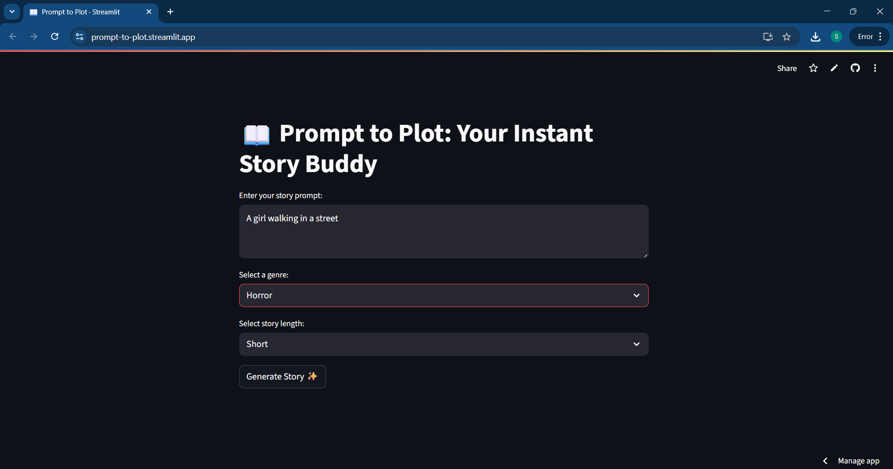
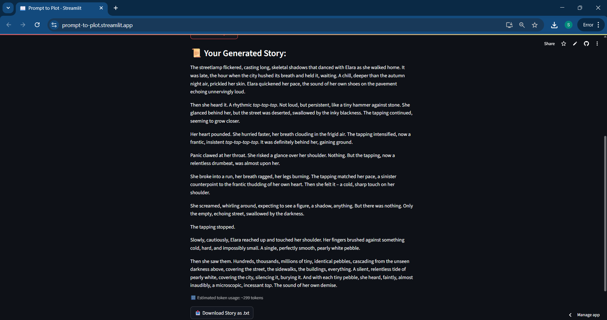

# 📖 Prompt to Plot: AI Story Generator

[](LICENSE)
[](https://www.python.org/downloads/)
[](https://streamlit.io/)
[](https://makersuite.google.com/app)

---

## Table of Contents
- [Demo](#demo)
- [Overview](#overview)
- [Installation](#installation)
- [How to Use](#how-to-use)
- [Deployment on Streamlit](#deployment-on-streamlit)
- [Directory Tree](#directory-tree)
- [Bug / Feature Request](#bug--feature-request)
- [Future Scope](#future-scope)
- [License](#license)
- [Author](#author)

---

## Demo

> 💻 **Live Demo**: [Click here to try!](https://your-streamlit-app-url.streamlit.app)

### UI Preview:

**Prompt & Genre Input**  


**Generated Story Output**  


---

## Overview

**Prompt to Plot** is a Streamlit-based AI storytelling app that transforms your ideas into creative narratives using the **Gemini 1.5 Flash** model from Google.

This project is ideal for:
- Writers looking for inspiration  
- NLP learners and students  
- Educators teaching AI-generated content  
- Anyone who loves imaginative storytelling

### 🧩 Key Features:
- Prompt input from user  
- Genre selection (Horror, Sci-Fi, Romance, etc.)  
- Adjustable story length (Short / Medium / Long)  
- Powered by Gemini 1.5 Flash (Google Generative AI)  
- Token usage estimation per story  
- Download story as `.txt`  
- Runs within Google's free tier (2M tokens/month)

---

## Installation

> Requires **Python 3.11**

### 1. Clone the Repository

```bash
git clone https://github.com/ANUSHKA49282/prompt-to-plot.git
cd prompt-to-plot
```

### 2. Install Dependencies

```bash
pip install -r requirements.txt
```

### 3. Add Gemini API Key

Create a file named `.env` in the root folder:

```env
GEMINI_API_KEY=your_gemini_api_key_here
```

> Get your free key here: https://aistudio.google.com/app/apikey  
> Make sure to use **Gemini 1.5 Flash** to stay in the free tier.

---

## How to Use

```bash
streamlit run app.py
```

1. Enter your story prompt  
2. Choose a genre and length  
3. Click **Generate Story ✨**  
4. Read and download your AI-generated story  
5. See estimated token usage to track free-tier consumption

---

## Deployment on Streamlit

To deploy your app on [Streamlit Cloud](https://streamlit.io/cloud):

1. Sign in with GitHub  
2. Create a new app using this repo: `ANUSHKA49282/prompt-to-plot`  
3. Set `app.py` as the main file  
4. In **Advanced settings → Secrets**, add:

```env
GEMINI_API_KEY=your_gemini_api_key_here
```

5. Click **Deploy**

> ⚠️ This app uses your Gemini key, and usage will count toward your free quota. You will not be billed unless you’ve enabled Google Cloud billing.

---

## Directory Tree

```text
prompt-to-plot/
├── app.py
├── .env              # (ignored by .gitignore)
├── LICENSE
├── README.md
├── requirements.txt
├── .gitignore
└── screenshots/
    ├── input.png
    └── output.png
```

---

## Bug / Feature Request

Found a bug or want a new feature?  
Open an issue here:  
👉 https://github.com/ANUSHKA49282/prompt-to-plot/issues

---

## Future Scope

1. **Genre-Based Prompt Suggestions**  
   Auto-fill example prompts based on selected genre

2. **Voice Narration**  
   Add text-to-speech for the generated story

3. **User Login & Saved Stories**  
   Allow users to save and revisit past stories

4. **Multi-language Support**  
   Generate stories in Hindi, Telugu, and more

5. **Image-to-Story Mode**  
   Upload an image and let the AI create a story based on it


---

## License

Distributed under the MIT License.  
See [LICENSE](LICENSE) for more details.

---

## Author

**Anushka**  
B.Tech Student, VIT AP University  
GitHub: [ANUSHKA49282](https://github.com/ANUSHKA49282)
